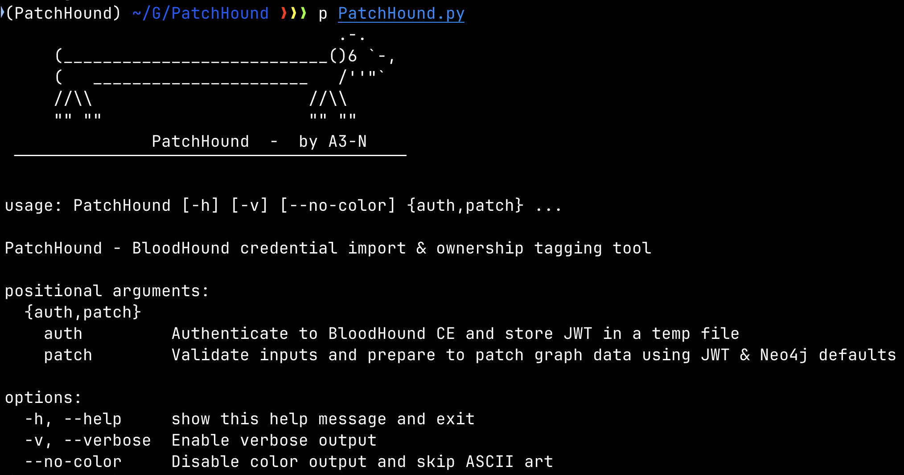
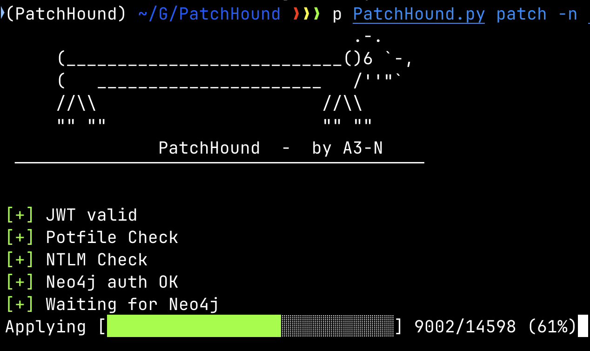
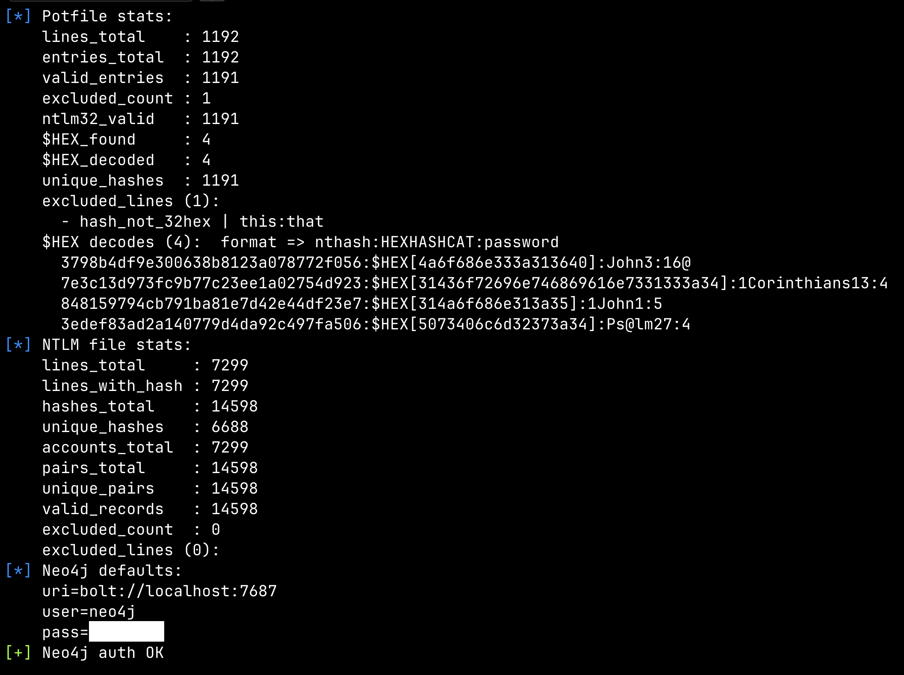
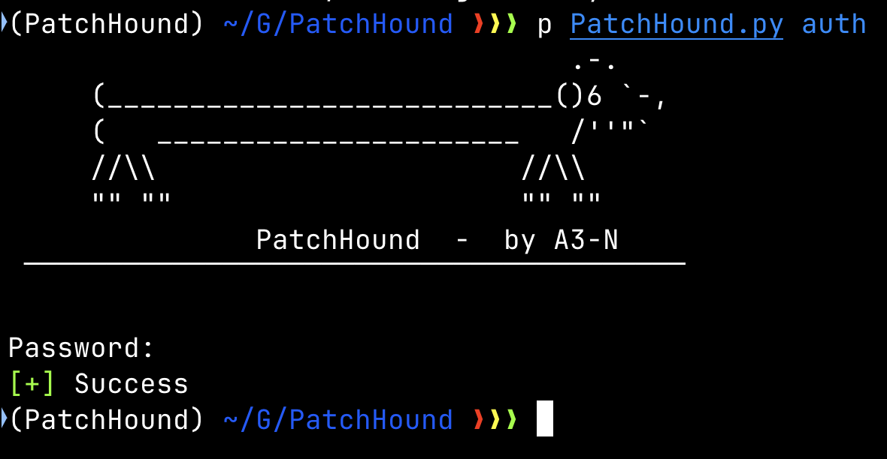
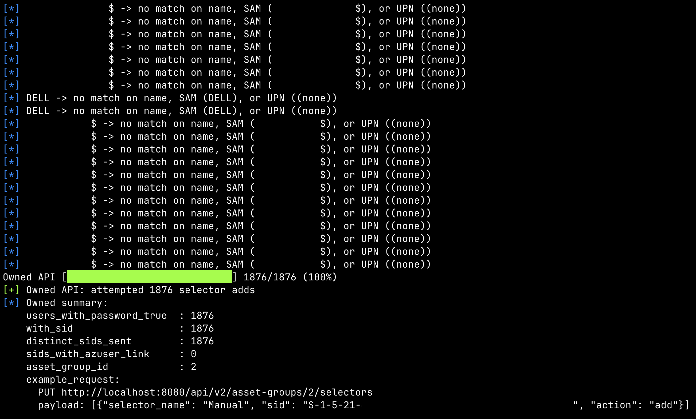
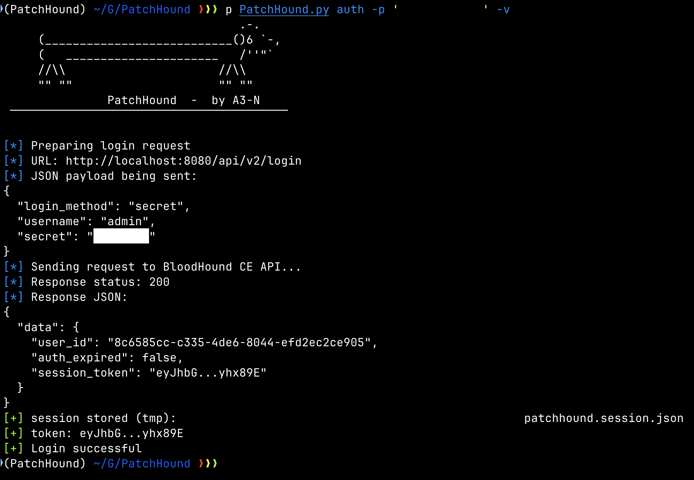

# PatchHound

Credential signal importer + “Owned” tagging helper for **BloodHound Community Edition (CE)**.

> Inspired by [knavesec/Max](https://github.com/knavesec/Max)



---

## TL;DR

- **auth** — log in to BloodHound CE and cache a JWT (used by other commands).
- **patch** — read a **potfile** (cracked creds) + **NTLM file**, parse, stats, and update graph nodes in Neo4j _minimally_.  
  - Always sets:
    - `Patchhound_has_hash` **(bool)**
    - `Patchhound_has_pass` **(bool)** – true when a cracked password is known
  - With `-t/--temp` **also** writes (temporary convenience values):
    - `Patchhound_nt`  – NTLM hash
    - `Patchhound_pass` – plaintext password  
    _These two are expected to be ephemeral; BloodHound CE does not persist custom node props across container restarts by default._
  - With `-o/--owned` **after** patching, discover eligible SIDs via **Neo4j** and then **append** “Owned” selectors via the BloodHound **v2 HTTP API** (defaults to asset group id **2**).  
    - Lookups (who to own) happen **only in Neo4j**; the API is used **only** to append the Owned selectors.

- **search** (optional helper) — lightweight BHCE search (if present in your tree).

Colors can be disabled with `--no-color` (or `--nocolor` in older examples). Verbose output via `-v`.


---

## What’s New (this version)

- **Minimal graph writes by default:** only `Patchhound_has_hash` and `Patchhound_has_pass`.
- **Temporary writes with `-t`:** add `Patchhound_nt` and `Patchhound_pass`.
- **“Owned” via API with `-o`:**  
  - Query Neo4j for `:User` nodes where `Patchhound_has_pass = true` and a non-empty SID (`objectid`).  
  - Also note which of those SIDs have a linked `:AZUser` with the same **on‑prem SID** (several common property names supported).  
  - Append those SIDs to an **asset group** using `PUT /api/v2/asset-groups/{id}/selectors` (default group id `2`, override with env `PATCHHOUND_ASSET_GROUP_ID` or `--asset-group-id` if you add that flag).
- **Better identity matching (no fallbacks; union of all paths):**  
  - `:User {name}` (e.g., `DOM\sam`)  
  - `:User.samaccountname`  
  - `:User.userprincipalname` / `userPrincipalName`  
  - `:AZUser.userprincipalname` / `userPrincipalName`  
  - `:Computer.samaccountname`  
  - Case-insensitive comparisons for SAM/UPN; UPN can be **synthesized** from `dom.com\SAM → SAM@dom.com` when UPN token isn’t present.
- **Cleaner output:**  
  - Non-verbose: just the green checks `JWT valid`, `Potfile Check`, `NTLM Check`, `Neo4j auth OK`, plus “Waiting…” banners before progress bars.  
  - Verbose: pretty, line-per-stat blocks; `$HEX[...]` decodes printed as `nthash:HEXHASHCAT:password`; excluded lines (with reasons).

---

## Installation

```bash
python3 -m venv .venv && source .venv/bin/activate
pip install neo4j requests
```

Defaults live in **`src/conn.py`**:
- `DEFAULT_URI`
- `DEFAULT_USER`
- `DEFAULT_PASS`  (BH CE default is `bloodhoundcommunityedition`)

Adjust there or wire flags as you prefer.

---

## Usage

### Help
```bash
python3 PatchHound.py --help
```

### 1) Authenticate (stores JWT for other commands)
```bash
python3 PatchHound.py auth   -u http://localhost:8080/   -U admin   -p 'bloodhoundcommunityedition'   [-v]
```
- Writes a session file at: `${TMPDIR}/patchhound.session.json`
- Example non-verbose output:
```
[+] JWT valid
```

### 2) Patch (parse files, set minimal flags; optional temp writes)
```bash
python3 PatchHound.py patch   -c crack.potfile   -n ntds.txt   [-k kerberos.txt]   [-t] [-o] [--asset-group-id 2]   [--no-color] [-v]
```

**What it reads**
- `-c/--clears` **potfile** — expected format: `<32hex_ntlm>:<password>`  
  - `$HEX[...]` values are decoded; in verbose you’ll see lines like:
    ```
    nthash:$HEX[hex...]:decoded-password
    ```
  - Any line that doesn’t match the expected schema is **excluded** and listed (verbose) with a reason.
- `-n/--ntlm` **hash file** — consumes lines containing one or more 32-hex NTLMs and an account token:
  - prefers `DOMAIN\SAM`; captures explicit UPN tokens where present; **synthesizes** UPN as `SAM@fqdn` when possible.
  - Non-conforming lines are excluded with reasons (verbose).

**How matching works (Neo4j)**
- For each candidate row we try all of these simultaneously:
  - `(:User {name})`
  - `(:User).samaccountname`
  - `(:User).userprincipalname | userPrincipalName`
  - `(:AZUser).userprincipalname | userPrincipalName`
  - `(:Computer).samaccountname`
- Comparisons for SAM/UPN are case-insensitive (`toUpper` on both sides).  
- Nodes are de-duplicated and updated idempotently.

**What gets written**
- Always:
  - `Patchhound_has_hash = true`
  - `Patchhound_has_pass = (pwd != null)`
- With `-t/--temp`:
  - `Patchhound_nt = <ntlm>`
  - `Patchhound_pass = <password>`

**Output**
- Non-verbose:
  ```
  [+] JWT valid
  [+] Potfile Check
  [+] NTLM Check
  [+] Neo4j auth OK
  [+] Waiting for Neo4j
  Applying [█████░░░░░░░░░░░░░░░░░░░░░] 750/14598 (5%)
  [+] Updated nodes: 1234
  ```
- Verbose also prints pretty stats, decoded HEX, and excluded input lines.

### 3) “Owned” append via API (with `-o`)
- After patching (or even when nothing is applied), `-o` will:
  1. Query **Neo4j** for users where `Patchhound_has_pass = true` and a non-empty SID (`u.objectid`).
  2. Count how many of those SIDs have a matching `:AZUser` on‑prem SID (several property names supported).
  3. **Append** those SIDs to the configured **asset group** via BHCE v2 API.

- Non-verbose:
  ```
  [+] Waiting for Neo4j and API
  Owned API [████████████████████████████] 1876/1876 (100%)
  [+] Owned API: attempted 1876 selector adds
  ```

- Verbose final summary (printed **after** all logic):
  ```
  [*] Owned summary:
      users_with_password_true  : 1876
      with_sid                  : 1876
      distinct_sids_sent        : 1876
      sids_with_azuser_link     : 0
      asset_group_id            : 2
      example_request:
        PUT http://localhost:8080/api/v2/asset-groups/2/selectors
        payload: [{"selector_name":"Manual","sid":"S-1-5-21-...","action":"add"}]
  ```

**Configuration**
- Default asset group id: **2**  
  - Override with environment: `PATCHHOUND_ASSET_GROUP_ID=7`  
  - Or add a CLI flag to your parser: `--asset-group-id 7`

---

## Flags (current)

- `-v, --verbose` — verbose output (stats, excluded lines, HEX decodes, summaries)
- `--no-color` — disable colored/ASCII output
- `patch`:
  - `-c, --clears` — path to potfile (**required**)
  - `-n, --ntlm` — path to NTLM hash file (recommended)
  - `-k, --kerberos` — (accepted, currently unused)
  - `-t, --temp` — write `Patchhound_nt` and `Patchhound_pass`
  - `-o, --owned` — append “Owned” selectors via API based on Neo4j discovery
  - `--asset-group-id` — optional, override asset group id (otherwise env or default 2)
- `auth`:
  - `-u, --url`
  - `-U, --username`
  - `-p, --password`

---

## Notes & Caveats

- BloodHound CE typically does **not** persist arbitrary custom node properties across container restarts; the temporary fields (`Patchhound_nt`, `Patchhound_pass`) are intended as **ephemeral conveniences**.
- UPNs can be lower or upper; comparisons are case-insensitive. For logs, you might see uppercase normalization.
- `:AZUser` often lacks `samAccountName`; when hybrid, an on-prem SID may be available under several different property names. The matcher checks the common ones.

---

## Troubleshooting

- `Neo4j driver not installed` → `pip install neo4j`
- `JWT invalid` → re-run `auth`
- No updates applied:
  - Potfile has no valid lines (format must be `32hex:password`)
  - NTLM file had no `(acct, hash)` pairs
- Owned append failed:
  - Check API base URL and JWT in the session file
  - Verify your account can mutate asset groups; AAD proxy / reverse proxy headers can interfere

---

## Screenies





