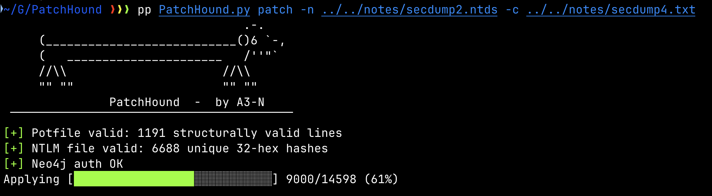
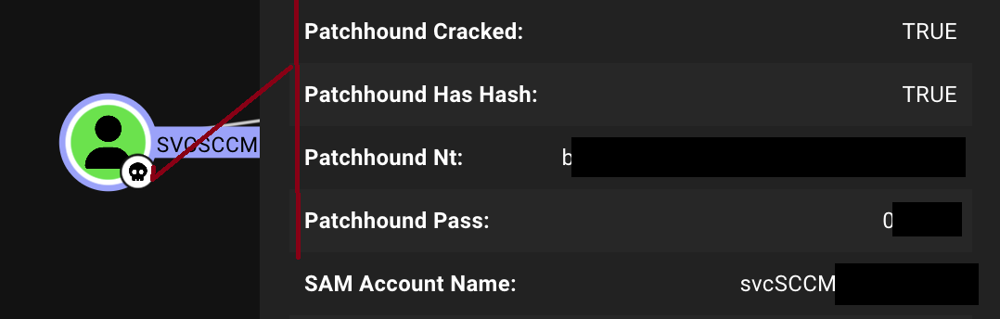
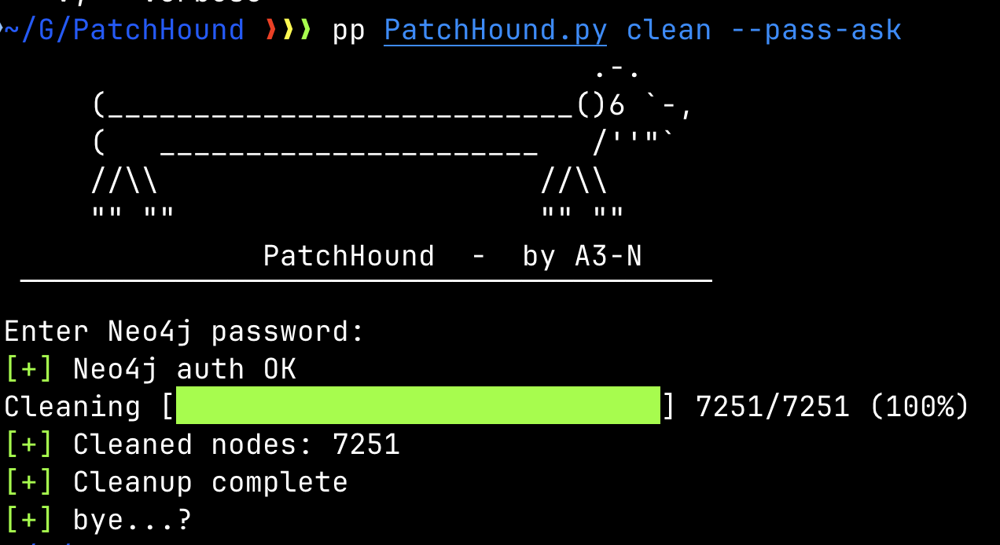
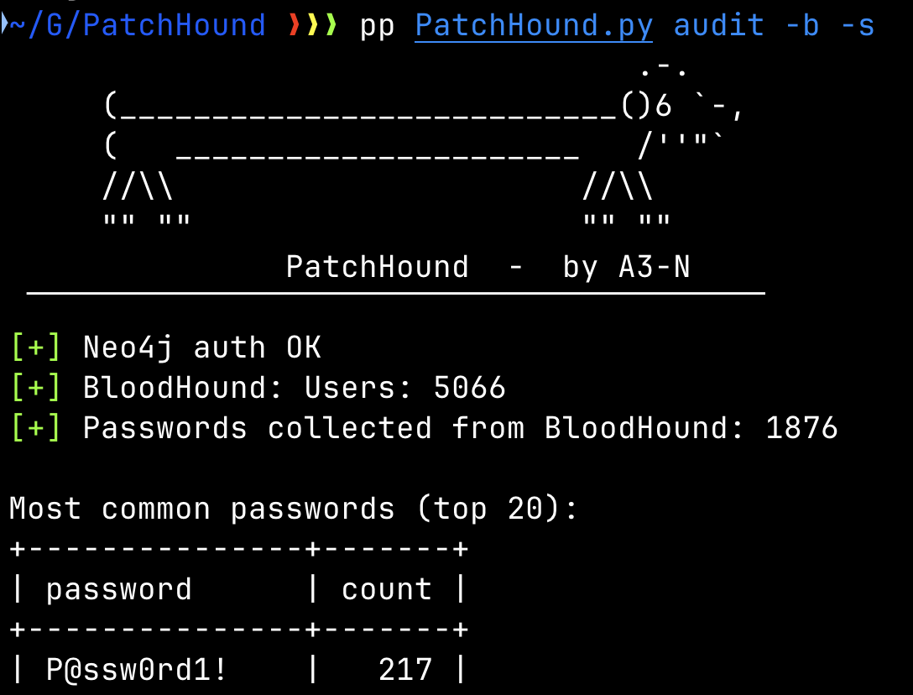
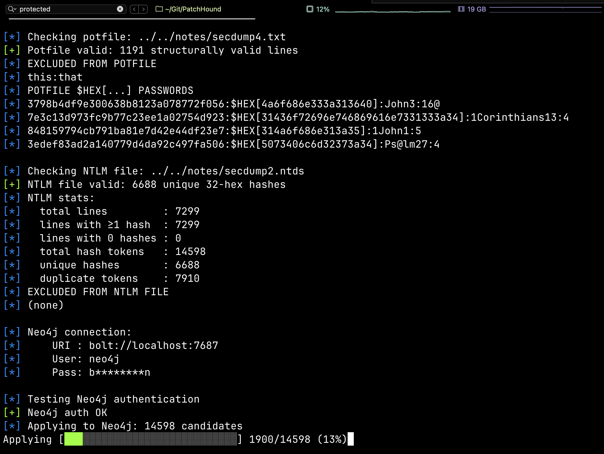
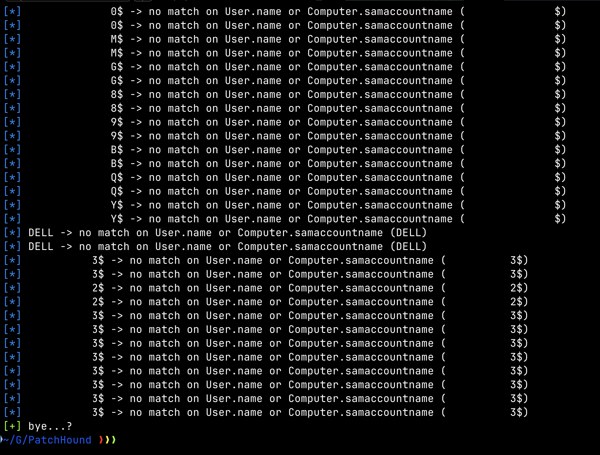

# PatchHound

### Password and NTLM hash mapping for BloodHound Community Edition.

Idea inspired by [knavesec/Max](https://github.com/knavesec/Max).



## Warrit Do?
- **patch**: joins NTLM hashes to cracked passwords and updates `:User`/`:Computer` nodes.
  - Sets: `Patchhound_has_hash` (bool), `Patchhound_nt` (hash), `Patchhound_cracked` (bool if password known), `Patchhound_pass` (password).
  - **Owned** (and `system_tags += "owned"`) only when **both** hash **and** password are present.
  
  
  - `--redact` stores **no** `Patchhound_nt`/`Patchhound_pass` values (booleans still set).
- **clean**: removes all `Patchhound_*` properties, clears `owned`, removes `"owned"` tag.


- **audit**: quick presence checks; with `--stats` prints **top passwords** and **length distribution**.
  - `-b` pulls from graph (supports both `Patchhound_*` and `PatchHound_*` casings).
  - `-c/-n` joins potfile to NTLM to reflect **per-account** reuse.
  

Colours can be disabled with `--nocolor`.

## Quick start

```bash
pip install neo4j
```

Defaults live in `src/conn.py`:
- `DEFAULT_URI`
- `DEFAULT_USER`
- `DEFAULT_PASS` (BloodHound CE default: `bloodhoundcommunityedition`)

_Otherwise, use flags to define values, or adjust values within the file itself._

## Usage

### Help
```bash
python3 PatchHound.py help
```

### Patch (import to BloodHound)
```bash
python3 PatchHound.py patch -c crack.potfile -n ntds.txt \
  [--uri bolt://neo4j:7687] [-u neo4j] [-p 'pass' | --pass-ask] \
  [--redact] [--nocolor] [-v]
```

**Note:** the -v flag should be fairly verbose for debugging, seeing what connections strings are and what entries where skipped and not added. _Cant miss a DA password ;), and this also helps with spotting a few things like hashcat $HEX_



### Clean (undo PatchHound changes)
```bash
python3 PatchHound.py clean \
  [--uri bolt://neo4j:7687] [-u neo4j] [-p 'pass' | --pass-ask] \
  [--nocolor] [-v]
```

### Audit

**Mode required**: either `-b` **or** `-c POT -n FILE`.  
Also must include at least one extra flag (e.g., `--stats`)

Graph-based:
```bash
python3 PatchHound.py audit -b [--stats] \
  [--uri bolt://neo4j:7687] [-u neo4j] [-p 'pass' | --pass-ask] \
  [--nocolor] [-v]
```

File-based:
```bash
python3 PatchHound.py audit -c crack.potfile -n ntds.txt --stats \
  [--nocolor] [-v]
```

`--stats` prints:
- **Most common passwords (top 20)** – deterministic (count desc, then password).
- **Password length distribution** – weighted by reuse count.

---

### ^^^

Above is old readme, still need to update it, moved over to more API than direct neo4j insertions. 