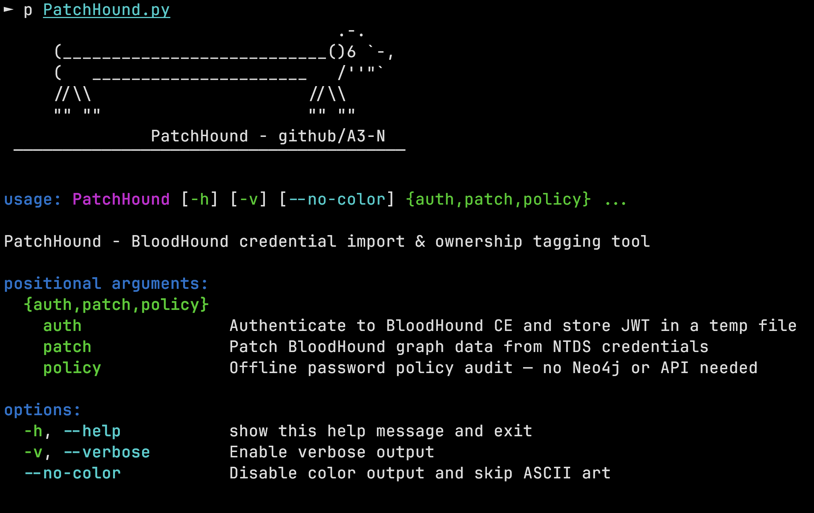
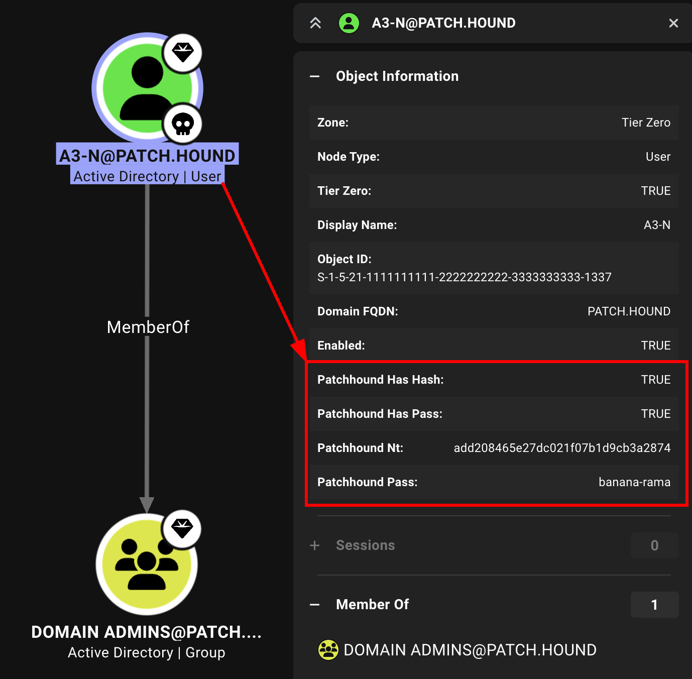
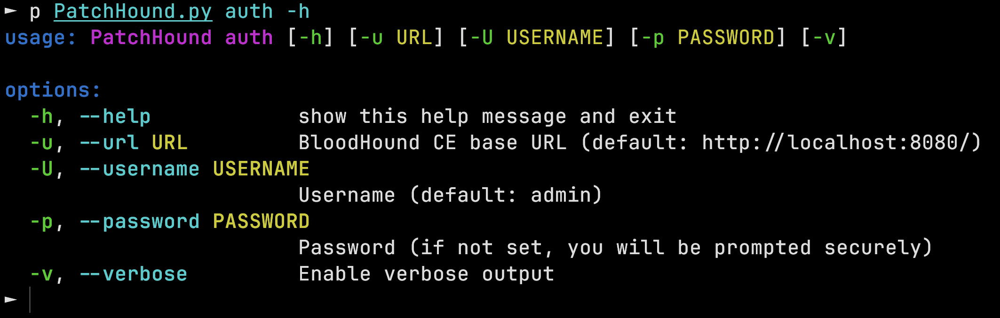
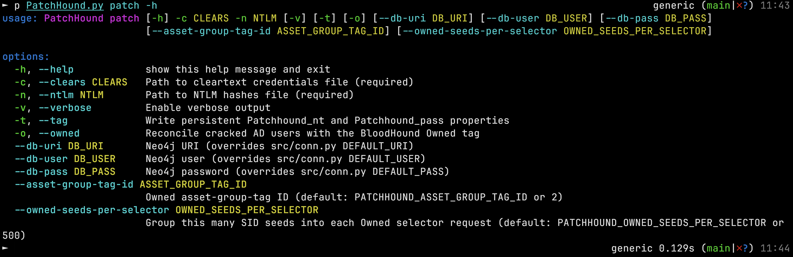
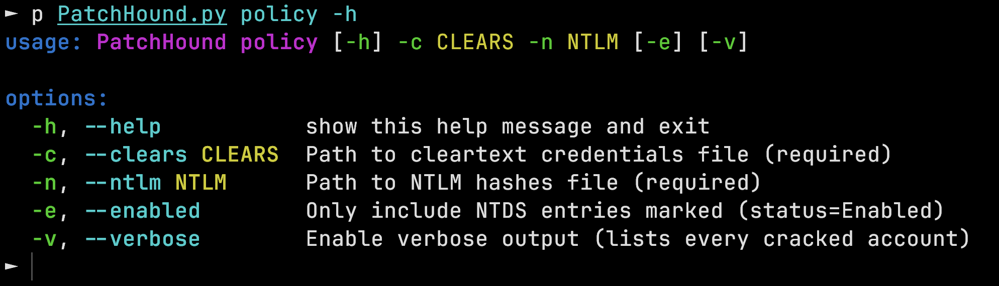
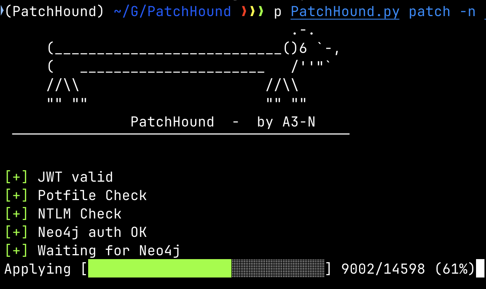
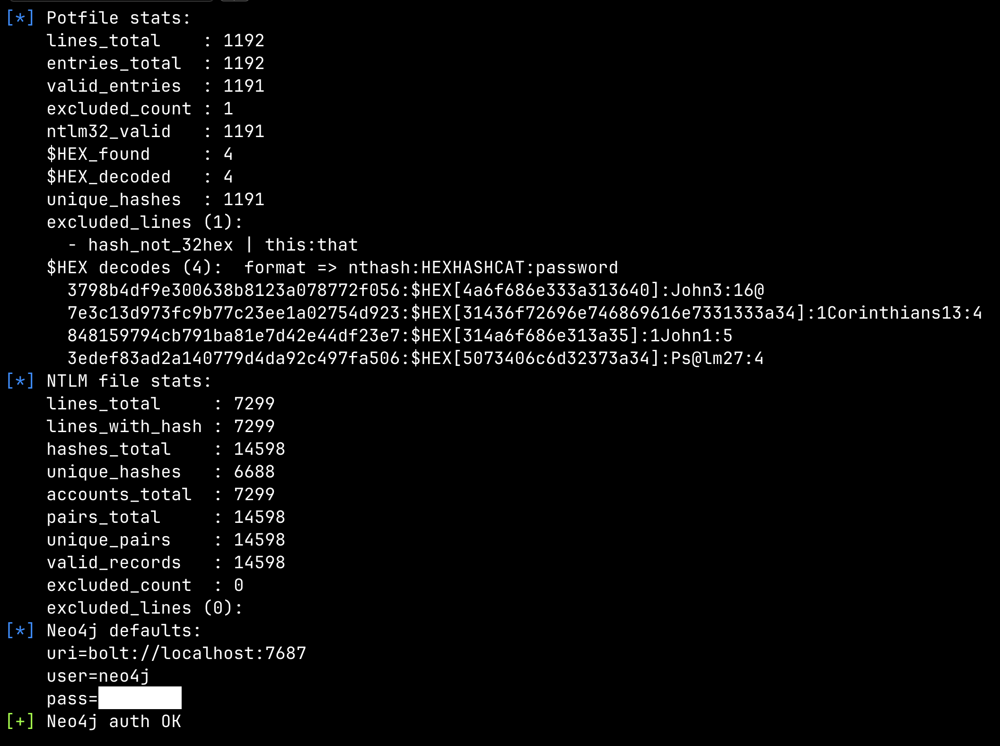
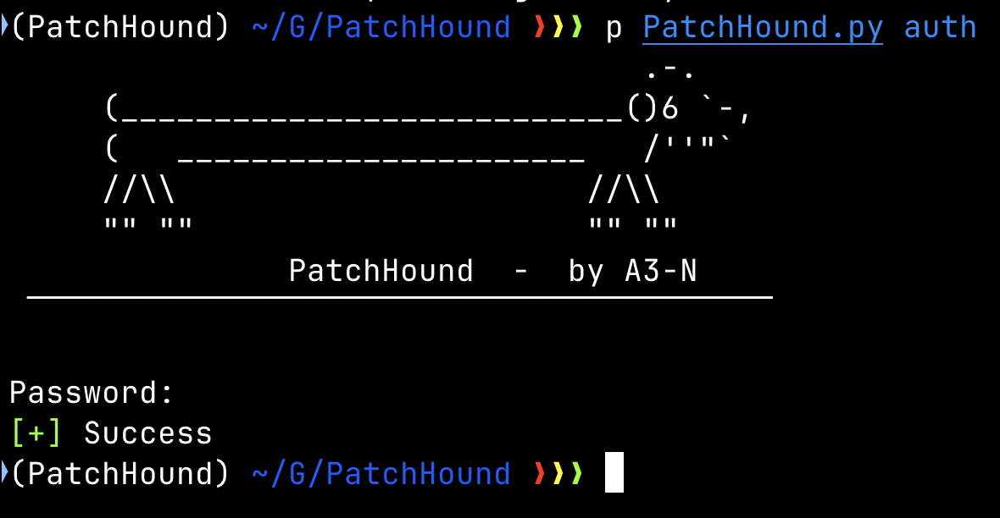
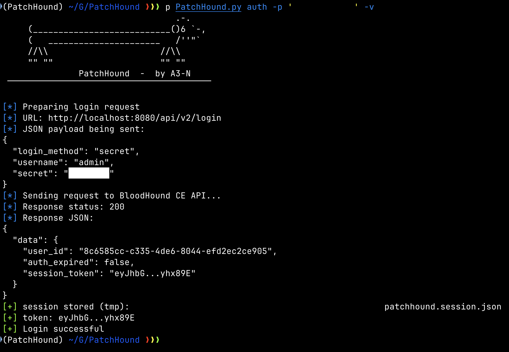
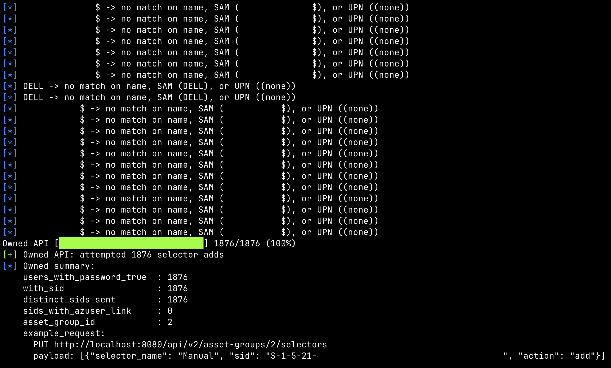

# PatchHound

Credential importer + “Owned” tagging for **BloodHound Community Edition (CE)**.

> Inspired by [knavesec/Max](https://github.com/knavesec/Max)



---

## TL;DR

- **auth** — log in to BloodHound CE and cache a JWT.
- **patch** — parse **potfile** + **NTDS**, and patch graph nodes in Neo4j.
- **policy** — offline password audit using the same **potfile** + **NTDS**.



---

## Installation

```bash
python3 -m venv .venv && source .venv/bin/activate
python3 -m pip install .
```

---

## Usage

The main script operates by three subcommand.
- `auth`
- `patch`
- `policy`

Each subcommands supports `-h/--help` and `-v/--verbose`

### auth
```bash
python3 PatchHound.py auth
```
_authenticates to the bloodhound instance in order to use `patch`_



Session file write:
- `${TMPDIR}/patchhound.session.json`

---

### patch
```bash
python3 PatchHound.py patch -c <crack.potfile> -n <ntds.dit> [-t] [-o]
```
_maps the NTDS file NT hashes and passwords to bloodhound properties_



The following is required for `-c/--clears`:
- Presented within a file format of `nt_hash:password` for each new line.
- The file content can be exported via `hashcat -m1000 NTDS.dit --show`

The following is required for `-n/--ntlm`:
- NTDS.dit or equivilant with a impacket secretsdump format.
- Example line `<domain>\<user>:<rid>:<lm>:<nt>:::`

Optional flags would be `-o/--owned` `-t/--tag`:
- `-o` Reconcile cracked AD users with the BloodHound Owned tag
- `-t` Write  Patchhound_nt and Patchhound_pass to user properties

Defaults live in **`src/conn.py`**:
```sh
DEFAULT_URI = "bolt://localhost:7687"
DEFAULT_USER = "neo4j"
DEFAULT_PASS = "bloodhoundcommunityedition"
```

Default override:
```sh
python3 PatchHound.py patch --db-uri <uri//ip:port> --db-user <user> --db-pass <pass>
```

### policy
```bash
python3 PatchHound.py policy -c crack.potfile -n ntds.txt [-e] [-v]
```
_audit the current cracked password along with service account relevance_



The following is required for `-c/--clears`:
- Presented within a file format of `nt_hash:password` for each new line.
- The file content can be exported via `hashcat -m1000 NTDS.dit --show`

The following is required for `-n/--ntlm`:
- NTDS.dit or equivilant with a impacket secretsdump format.
- Example line `<domain>\<user>:<rid>:<lm>:<nt>:::`

Optional flag would be `-e/--enabled`:
- Only include NTDS entries marked (status=Enabled) within results

---

# random screenshots











